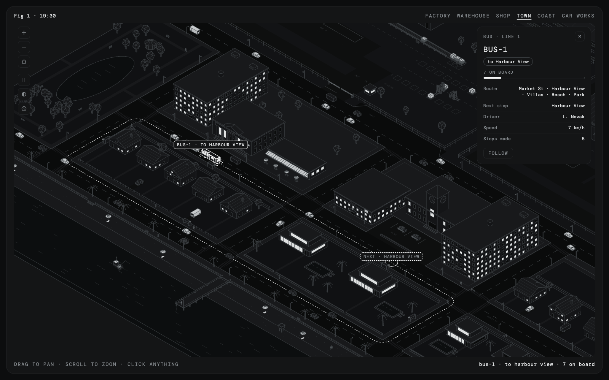
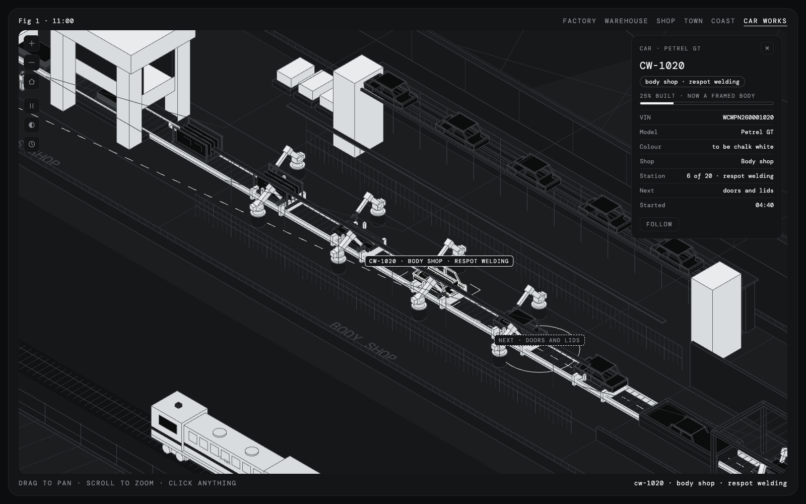

# Factory Yard

A live isometric town drawn with WebGL in the hairline style of [ai-iso-skill](https://github.com/MrBongoC/ai-iso-skill).

Goods go from a factory to a warehouse along the main road of a small seaside town, and on to a shop by the sea:
- Behind the town are hills; in front of it, the sea.
- A day passes in six minutes. Windows, street lamps, headlights and the lighthouse come on at dusk.
- There is no dashboard. Click anything and a card shows its live details; click a vehicle and its route appears.



## Open it

It's a Next.js app that builds to a static site. You need Node 20 or later.

```
npm install
npm run dev
```

Then go to <http://localhost:3000>.

To build the site, run `npm run build`. It writes plain HTML and JS to `out/`, so you can host it anywhere. To try the built copy locally, run `npm run preview`.

## How the code is laid out

| Folder | What's in it |
| --- | --- |
| `app/` | The page, the layout (which self-hosts DM Mono) and `globals.css` with the colour tokens |
| `components/YardFigure.tsx` | The plate around the map: caption, buttons, tags and the card. It loads the engine in the browser. |
| `yard/kernel/` | The iso projection, `Part` (boxes, faces, hairlines, text), `Path`, the corridor graph and the seeded random numbers |
| `yard/theme.ts` | Tokens → materials, and the day/night blend |
| `yard/models/`, `yard/world/` | Vehicles, people, boats, and the static town |
| `yard/sim/` | The simulation: clock, traffic, trucks, forklifts, people, homes, the shop and its courier, the police, the fire station, the pier, fishing, weather, Car Works and the train |
| `yard/view.ts` | Camera, selection, card, routes, peeking into buildings, the frame loop, keys |
| `yard/index.ts` | Builds everything in a fixed order and starts the view |

The engine runs once per page load. React draws the plate, and the engine drives it from then on.

## The places

| Place | What's there |
| --- | --- |
| **Factory** | Plant 01, its conveyor, staging, two loading bays, a truck park for flatbeds waiting for a free bay, and the rail loading platform |
| **Warehouse** | Warehouse 01: two rows of racks three levels high, shelving with a packing bench and pickers, a loading lane, two docks, and a sliding gate with its guard |
| **Shop** | Corner Market on the seafront, where Hill Av meets Coast Rd: its delivery lay-by, a zebra crossing, and parking bays across the road on the promenade |
| **Town** | Flats, Harbour Bank, Café Mira, the police station, Town Hall (whose clock tells the simulated time), houses with gardens and villas with pools. Orchard Lane, a new street of six houses, runs off the roundabout. Riverside Fire Station stands on Riverside Rd with ENG-1 in its bay. Mill Park lies on the west side. |
| **Car Works** | A car factory on a terrace cut into the hills behind the warehouse, its lot of finished cars in front. Inside, one line runs through a press shop, a body shop of welding robots, a paint shop, assembly and the end-of-line tests. |
| **Railway** | One track along the foot of the hills, with a loop through the Plant 01 yard and its loading platform |
| **Coast** | Coast Rd, the promenade, the beach, the town pier, Sunset Pier with its rides, and a breakwater with a lighthouse. A sailboat, a motorboat and the fishing boat Kestrel are out at sea. |

## What moves

1. **Plant 01:** a pallet leaves the factory on Line A every 26 s. Forklifts FL-01 to FL-03 load the train while it stands at the platform, then the flatbed waiting at a bay, and otherwise clear the belt into staging.
2. **Flatbeds (TRK-2051 to TRK-2053):** the three trucks share two bays and two docks.
   - A loaded truck waits at its bay until a dock is free, then crosses the road.
   - It goes round the roundabout, and the guard opens the warehouse gate.
   - On the way back it waits in the truck park until a bay is free.
3. **Warehouse 01:** forklifts FL-04 to FL-06 unload the flatbeds into the racks, lifting to the top level with a telescoping mast. They load the box trucks from the rear in the loading lane. Two pickers carry parts from the shelving to the packing bench.
4. **Box trucks (DLV-01 to DLV-03):** they carry four pallets down Hill Av to the shop, open their rear doors in the lay-by, and staff carry the boxes in. They go back along Coast Rd and up Harbour Av, and cross Riverside Rd straight into the warehouse gate.
5. **Shoppers:** they walk in down Hill Av or along the promenade, or drive in, park in the bays on the seafront and cross at the zebra. They take boxes off the shelves, pay and leave.
6. **Online orders (PKG-1):** now and then a home orders from Corner Market.
   - A shop assistant picks the boxes, packs the parcel and carries it over the zebra to the parcel van.
   - PKG-1 drives to the house by the shortest way and pulls in at the kerb, and the courier walks it to the door.
   - The home's card shows the order with an arrival time and a Track parcel button. The camera then follows the van, and its card shows the order's timeline.
7. **Traffic:**
   - Cars pass through on Riverside Rd and Coast Rd.
   - Town cars loop round the blocks and give way where they join a busier street.
   - **The bus (BUS-1)** runs Line 1 round the southern blocks. It stops at five shelters, where people get off and queue to board.
8. **People:**
   - They walk the pavements from home to home, to the beach, the park, the café, the bank, the piers or the fair. They wait at the kerb for a gap, and traffic stops for anyone on the road.
   - Each has an outfit that suits who they are, from shoppers and staff to police, firefighters and line workers. Arms swing as they walk, and they sit at café tables and on benches. Some jog, and some walk a dog.
   - There are fewer people out at night, and fewer shoppers.
9. **Homes:** every house and villa can be looked inside. Its rooms are furnished, and whoever is home is on the sofa, at the table or in bed, depending on the hour. Delivered parcels wait inside the door.
10. **The bank job:**
    - Now and then a man in a dark hood cases Harbour Bank, goes in, makes for the vault, and the alarm goes off. Staff and customers get out.
    - Both police cars come with their lights flashing. Four officers surround the bank, at the front door either side, the back and the east wall.
    - Click the bank, the suspect or an officer to see inside. Usually, after a stand-off, two officers go in and bring him out. If he reaches the back door first, there is a chase, and he may get away.
11. **Sunset Pier:** a pleasure pier with a Ferris wheel, a carousel and a small coaster. Visitors queue, ride and wander. The rides open 10:00–23:00 and close in the rain.
12. **Fishing:** Kestrel leaves the town pier in the morning, fishes on the bay and lands her catch, which shows on her card. An angler fishes from the end of the town pier.
13. **Weather:** showers come through the day, and some mornings there is sea fog. People put up umbrellas and leave the beach, the park and the piers, the boats come in, and the caption says so.
14. **Car Works:**
    - Every 18 s the line moves on one station. Steel blanks come off the coils and are pressed into panels. Robots weld the underbody, frame the sides, respot the shell and hang the doors.
    - The body is dipped and painted chalk white or slate. In assembly it rides a hanger, the powertrain rises into it, and robots fit the wheels and glass.
    - At the end of the line come the fluids, a lights test, a rolling road and the light tunnel. Then the car drives out to the lot.
    - Click any car on the line to see its VIN, model, colour, station and how far built it is, with the rest of its way dashed. The factory's card has a Follow a new car button, which follows one from the press shop all the way to the lot.
    - A full lot stops the line until the train takes cars away.

    

15. **The freight train (FRT-7):**
    - Every few minutes it comes in from the east: a locomotive, four flat wagons and three car carriers.
    - At Car Works it stops alongside the lot, and a ramp is lowered behind it. Up to twelve finished cars back out of their spaces, drive round and up onto the carriers.
    - It runs on into the loop in the Plant 01 yard, where the forklifts load pallets onto the flat wagons. Then it leaves to the west.
16. **Chimney fires:**
    - Every so often a chimney catches. Smoke and flames rise from the stack, and whoever is home comes out onto the pavement.
    - A neighbour calls it in. The bell goes at Riverside Fire Station, the bay door rolls up, the watch runs to ENG-1, and it drives out with its lights flashing.
    - At the kerb the officer takes the gate and the driver the pump, while two firefighters run a hose up the garden path and put a jet on the chimney until it is out.
    - They make up the hose, the household goes back in, and ENG-1 drives home and backs into its bay while the traffic waits.
    - The house's card shows the fire and has a Track ENG-1 button. The station's card shows the watch and the last call.

Each stage only runs as fast as the next one lets it:
- A full shop keeps the box trucks waiting at the warehouse.
- Full racks keep the flatbeds at the docks.
- A full belt holds the production line.
- A full lot holds the car line until the train comes.

## Controls

| Action | Mouse / touch | Keys |
| --- | --- | --- |
| Go to a place | Factory · Warehouse · Shop · Town · Coast · Car Works, top right | `1`–`6` |
| Whole map | ⌂ button | `0` |
| Skip ahead six hours | clock button | `N` |
| Pan | drag | arrow keys |
| Zoom | scroll, pinch, or the + / − buttons | `+` `−` |
| Inspect something | click or tap it | `[` `]` cycle through vehicles |
| Follow the selection | Follow button | `F` |
| Close the card | × button, or click empty ground | `Esc` |
| Pause | ❚❚ button | `Space` |
| Light / dark | ◐ button | `T` |

Some cards have buttons: Look inside on buildings and homes, Track on an order or a fire, Follow ENG-1 at the fire station, and Follow a new car at Car Works.

When something that moves is selected, the map draws its route as a dashed line and rings its next stop:
- Trucks and the bus show their whole loop.
- Cars, forklifts and people show the way ahead.

The warehouse, the shop, the bank, the fire station, Car Works and the homes are closed buildings. Select one, or anything inside it, and it opens up as a section drawing so you can see in.

## How the skill carries over to WebGL

ai-iso-skill draws SVG figures with a small projection kernel. This page keeps the kernel's ideas and moves them to three.js.

- **Same projection.** The skill's `P(x,y,z)` (+x down-right, +y down-left, +z up) is exactly an orthographic camera looking down `(-1,-1,-1)`. `W(x,y,z)` swaps y and z into three.js's y-up world, so the whole scene is written in the skill's coordinates.
- **Same kernel.** `plane(O,U,V)`, `TOP`, `FRONT`, `SIDE` and `box(x,y,z,w,d,h)` keep their meanings. Doors, windows, ribs, road paint, zebras, signs, clock faces and text are drawn flat in a face's own 2D units and placed with that face's matrix.
- **Hairlines.** Every edge is a `LineSegments2` exactly 1 CSS pixel wide at any zoom, the WebGL equivalent of `vector-effect: non-scaling-stroke`. Faces are flat, unlit and opaque, so the depth buffer hides lines behind them.
- **Day and night.** Every colour is a CSS custom property, with one set for dark and one for light. Through the evening the materials slide toward a single night palette. Windows and lamps are two extra fills that light up as everything else darkens.
- **Section drawings.** The warehouse, the shop, the bank, the fire station, Car Works and every home have a shell and a cut. The cut follows technical drawings: walls cut low and hatched on the cut, and the roof as an outline only.
- **The look.** It uses two greys for lines and one `--live` colour, reserved for what is live: the selection and its route, a busy bay's lamp, a forklift's beacon, the police and fire light bars, the bank alarm, a chimney's flames, a welding robot's sparks and the lighthouse beam. Goods and uniforms use the two-tone fill.
- **The frame.** The page is a plate with `Fig 1` and the clock (and `night`, `rain` or `fog` when it is), the places, the instruction and a live readout in the four corners. At night the whole page goes dark, even in the light theme, and the ◐ choice is remembered.

three.js and the font are bundled with the site, so it runs without loading anything from elsewhere.

## For testing

- `?debug=1` exposes `window.yard`:
  - `step(seconds)` runs the simulation forward.
  - `skip(hours)` moves the clock.
  - `select(id)` and `screenOf(id)` pick something and give its position on screen.
  - `look(x, y, zoom)` and `view(i)` move the camera.
  - `all()` lists everything.
  - `drawCalls()` draws one frame and counts its draw calls (it works in a hidden window too).
  - `order(id)` places an online order now, for that home or any home.
  - `robbery()` starts the bank job now, when the town is quiet.
  - `weather(kind, seconds)` brings `'rain'`, `'fog'` or `'clear'`.
  - `fire(id)` starts a chimney fire now, at that house or any house.
  - `train()` brings the next train in now.
  - The `incident`, `sim`, `shop`, `bank`, `fireSys`, `worksSys` and `trainSys` state are there too.
- `?seed=<number>` changes the random seed. The simulation runs on a fixed 1/60 s step, so a given seed always plays out the same way.

## Credits

- Isometric kernel and visual language adapted from [ai-iso-skill](https://github.com/MrBongoC/ai-iso-skill) (MIT, © Tolga Cohce).
- Rendering by [three.js](https://threejs.org) (MIT).
